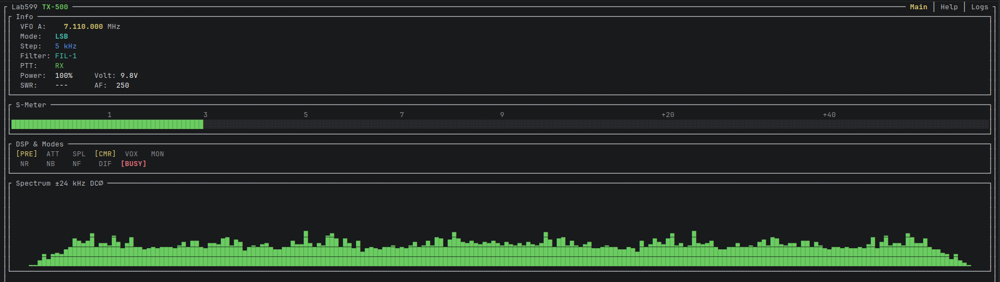

# lab599

Unofficial CAT control suite for the Lab599 TX-500 transceiver — protocol library and terminal UI, written in Rust.

## Components

| Crate | Description |
|-------|-------------|
| [lab599-cat](lab599-cat/) | Protocol library — `CatDriver<T>` generic over any `Read + Write` transport |
| [lab599-ctl](lab599-ctl/) | Terminal UI app (`lab599` binary) for real-time radio control |

## Screenshot



## Quick start

```sh
cargo build --release
```

```sh
# Launch the TUI — transceiver is detected automatically
lab599

# With IQ spectrum display
lab599 --iq-device <IQ-DEVICE>       # your audio device name, run with --list-audio to see available

# With RX audio loopback
lab599 --audio <AUDIO-DEVICE>         # e.g. "PipeWire"
```

Find your serial port:

```sh
ls /dev/serial/by-id/ | grep -i ftdi | xargs -I{} readlink -f /dev/serial/by-id/{}
```

## Workspace layout

```
lab599-cat/    — CAT protocol types + CatDriver<T>
lab599-ctl/    — terminal UI, binary: lab599
docs/          — protocol reference and TX-500 manual
```

## Documentation

- [CAT protocol reference](docs/cat-protocol-en.md)
- [TX-500 manual (EN)](docs/tx500-manual-en.md)
- [TX-500 manual (RU)](docs/tx500-manual-ru.md)
